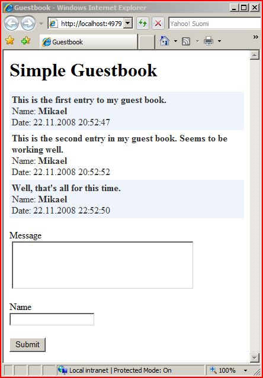

### Project: Digital Guestbook

#### Project Description:
Develop a digital guestbook where visitors can leave messages or comments for the website owner. The application will consist of two sections: one for submitting comments and another for viewing all comments. This project will be developed using Flask, with data stored in an SQLite database.

#### Learning Objectives:
* Understand the structure and components of HTML forms in the context of Flask.
* Retrieve and process form data in a Flask application.
* Connect to and interact with an SQLite database using Flask.
* Implement frontend and backend validation for form submissions.
* Display user-submitted data in a structured format.
* (Bonus) Implement advanced features like filtering and sorting comments.

#### Milestones:

1. **Setting Up the Flask Application**:
   - Connect to an SQLite database and create ONE table for storing guestbook entries (email, name and message column names).

2. **Designing the Guest Entry Form**:
   - Create an HTML form for the contact form. (with email, name and message HTML elements)

3. **Backend Endpoint for Form Submission**:
   - Implement a Flask route to handle form submissions (`POST` request should be done to `/`).
   - Retrieve form data from the request and validate it on the backend.
   - If validation passes, insert the data into the SQLite database. Otherwise, return an error message to the user.

4. **Frontend Data Validation**:
   - Implement client-side validation using JavaScript or HTML5 attributes to ensure that all fields are filled and are of the correct format.

5. **Backend Endpoint for Retrieving Comments**:
   - Implement a Flask route to retrieve all guestbook entries from the SQLite database (GET request should be sent to `/` as well)
   - Display the entries on a dedicated "View Guestbook" page in a structured format, such as a list or table.

6. **Bonus - Filtering and Sorting Comments**:
   - Add options to the "View Guestbook" page that allow users to filter comments based on specific criteria (e.g., name or date).
   - Implement sorting functionality to display comments in ascending or descending order based on user selection.
